# Arizona D2L to Notion

Arizona D2L to Notion is a chrome extension that can sync your [Arizona D2L Brightspace](https://d2l.arizona.edu/d2l/home) course data (assignments, quizzes, exams, and submission status) into a [Notion database](https://www.notion.com/help/intro-to-databases).
## Preview
### Table View
View what to do as a [list](https://www.notion.com/help/tables) of tasks

<picture>
    <source
        srcset="README/00_0_TablePreview_dark.png"
        media="(prefers-color-scheme: dark)"
    />
    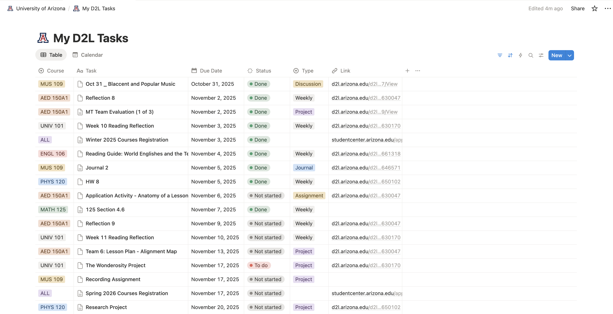
</picture>

### Calendar View
View what to do in your [calendar](https://www.notion.com/help/calendars)

<picture>
    <source
        srcset="README/00_1_CalendarPreview_dark.png"
        media="(prefers-color-scheme: dark)"
    />
    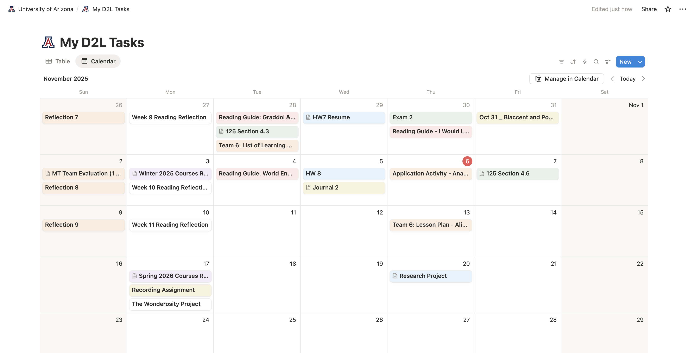
</picture>

# Download Chrome Extension
### Arizona D2L to Notion
Before you download, make sure you've read the [Disclaimer](#disclaimer)
1. Go to [the latest release](https://github.com/buttonbugs/Arizona-D2L-to-Notion/releases) &rarr; `Assets`
2. Click `Arizona_D2L_to_Notion_x.x.x.crx`

# Before You Use

## Setup Notion Database

### 1. Download Notion Desktop App
Go to [https://www.notion.com/download](https://www.notion.com/download) to download Notion Desktop App

### 2. Add Notion Account
Open Notion Desktop App and follow the instructions to sign up ([Free plan](https://www.notion.com/pricing) is enough) or log in

### 3. Duplicate Database Template
1. Go to [D2L Brightspace (Template)](https://buttonbugs.notion.site/2a2c1a64f0d880229eebcd11f4365956?v=2a2c1a64f0d881d7b367000cb9f4b112)
2. Click  in the upper right corner

<picture>
  <source
    srcset="README/01_3_duplicate_screen_dark.png"
    media="(prefers-color-scheme: dark)"
  />
  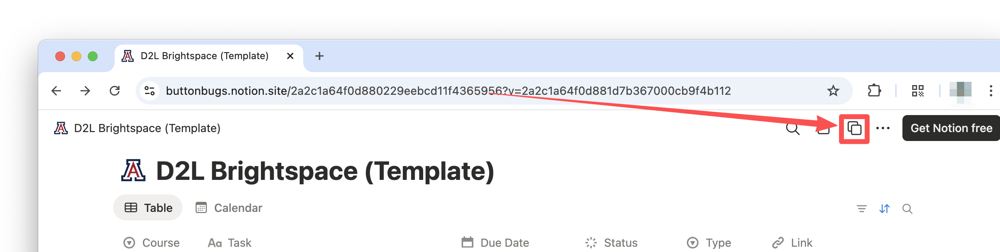
</picture>

3. Follow the instructions to duplicate the template to your desired location

<picture>
  <source
    srcset="README/01_3_duplicate_private_dark.png"
    media="(prefers-color-scheme: dark)"
  />
  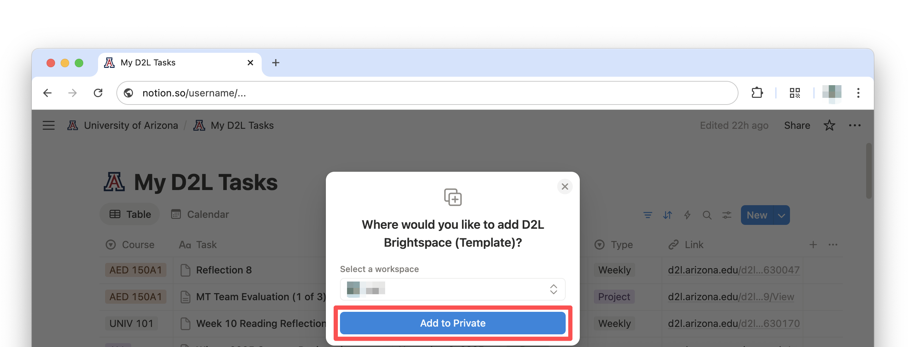
</picture>

### 4. Setup Notion Integration

1. Open the database [you've duplicated](#3-duplicate-database-template) in Notion Desktop App

2. Go to `...` &rarr; `Connections` &rarr; `Develop integrations` or go to [Marketplace Profile | Notion](https://www.notion.so/profile/integrations/)

<picture>
  <source
    srcset="README/01_4_go_to_integration_dark.png"
    media="(prefers-color-scheme: dark)"
  />
  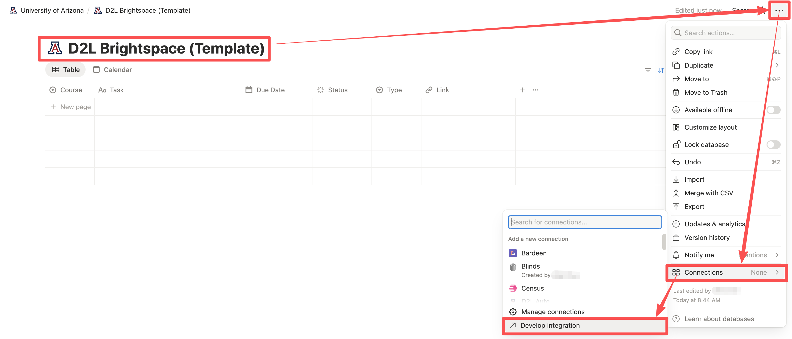
</picture>

3. Click `New Integration`

<picture>
  <source
    srcset="README/01_4_new_integration_dark.png"
    media="(prefers-color-scheme: dark)"
  />
  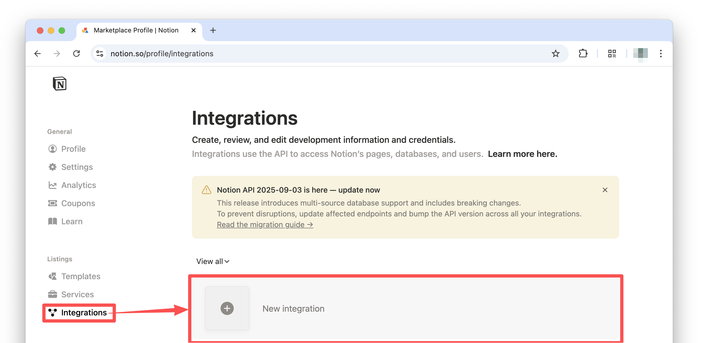
</picture>

4. Fill the form and click `Save`

    **1. Integration Name:** whatever you want ($${\color{red}Integration\ Name\ cannot\ contain\ the\ word\ “notion”}$$)

    **2. Associated workspace:** choose the one [you've created](#2-add-notion-account)

    **3. Type:** choose `Internal`

    **4. Logo (optional):** whatever you want

<picture>
  <source
    srcset="README/01_4_new_integration_form_dark.png"
    media="(prefers-color-scheme: dark)"
  />
  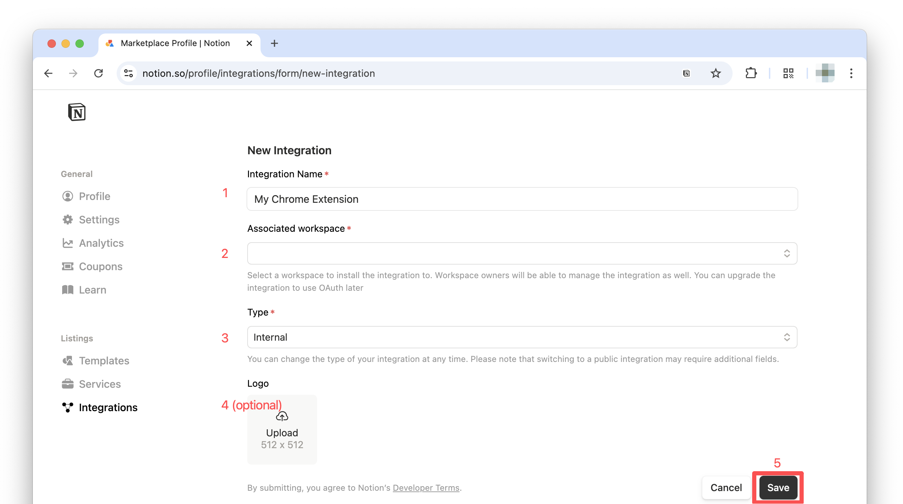
</picture>

5. Click `Configure integration settings`

6. Make sure `Read content` and `Update content` are on

<picture>
  <source
    srcset="README/01_4_integration_internal_dark.png"
    media="(prefers-color-scheme: dark)"
  />
  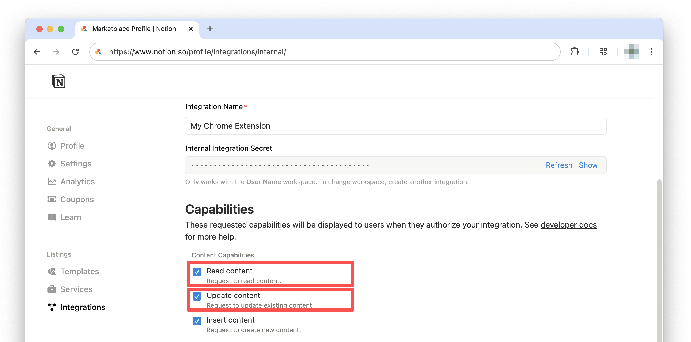
</picture>

7. Go back to the database [you've duplicated](#3-duplicate-database-template) in Notion Desktop App

8. Go to `...` &rarr; `Connections` &rarr; [The integration created [just now](#4-setup-notion-integration)] &rarr; `Confirm`

<picture>
  <source
    srcset="README/01_4_integration_connection_dark.png"
    media="(prefers-color-scheme: dark)"
  />
  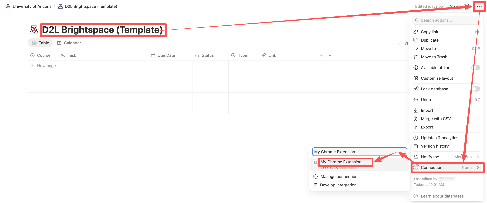
</picture>

## Setup Chrome Extension

### 1. Add the Chrome Extension to Chrome
1. Open Chrome Extension Settings
   
    You can input the link `chrome://extensions/` in the Chrome search bar and then ENTER (or go to `Chrome` &rarr; `Settings` &rarr; `Extensions`)

2. Turn On Developer Mode
<picture>
  <source
    srcset="README/02_1_2_open_extension_tab_dark.png"
    media="(prefers-color-scheme: dark)"
  />
  
</picture>

3. Drag the `Arizona_D2L_to_Notion_x.x.x.crx` file [you've downloaded](#download-chrome-extension) into the browser and click `Add extension`

### 2. Copy Notion API Token to the Extension

1. Go to `https://www.notion.so/profile/integrations/`

2. Click the integration created [just now](#4-setup-notion-integration)

<picture>
  <source
    srcset="README/02_2_2_go_to_integration_dark.png"
    media="(prefers-color-scheme: dark)"
  />
  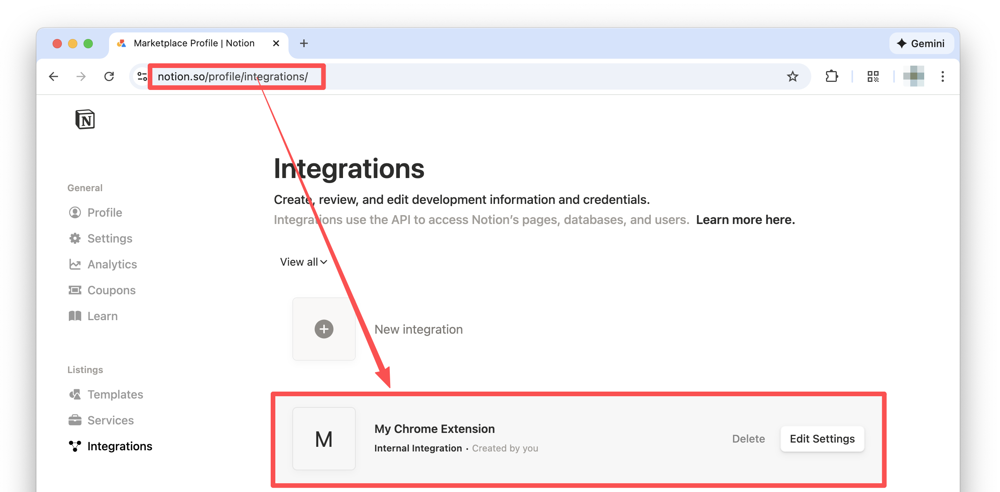
</picture>

3. Scroll to `Internal Integration Secret`

4. Click `show` and then `copy` ($${\color{red}DO\ NOT\ share\ it\ with\ anyone\ else}$$)

<picture>
  <source
    srcset="README/02_2_4_copy_token_dark.png"
    media="(prefers-color-scheme: dark)"
  />
  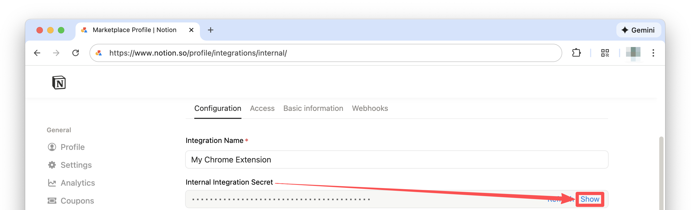
</picture>

5. Pin the extension's popup

<picture>
  <source
    srcset="README/02_2_5_pin_crx_dark.png"
    media="(prefers-color-scheme: dark)"
  />
  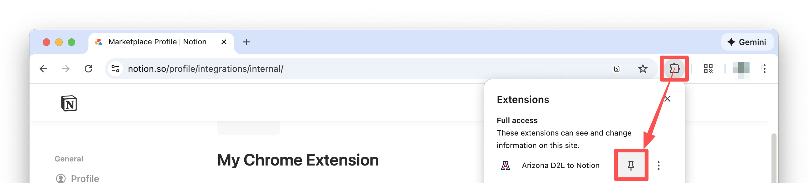
</picture>

6. Paste in `Notion API Token`

<picture>
  <source
    srcset="README/02_2_6_paste_token_dark.png"
    media="(prefers-color-scheme: dark)"
  />
  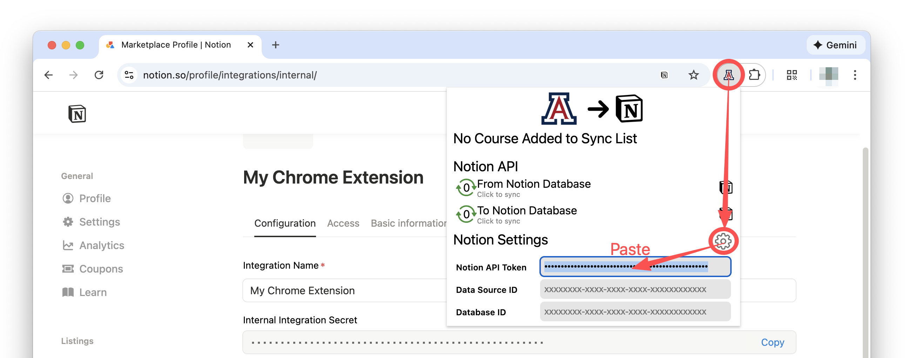
</picture>

### 3. Copy Notion Data Source ID to the Extension

1. Go back to the database [you've duplicated](#3-duplicate-database-template) in Notion Desktop App

2. Go to  &rarr; `Manage data sources` &rarr; `...` &rarr; `Copy data source ID`

<picture>
  <source
    srcset="README/02_3_2_data_sourse_settings_dark.png"
    media="(prefers-color-scheme: dark)"
  />
  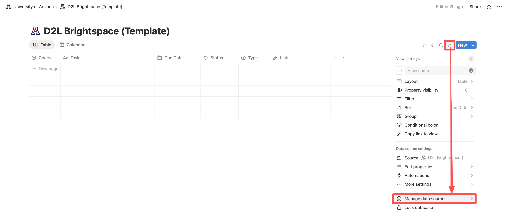
</picture>
<picture>
  <source
    srcset="README/02_3_2_copy_data_source_id_dark.png"
    media="(prefers-color-scheme: dark)"
  />
  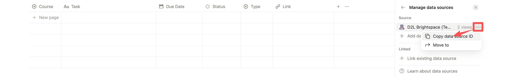
</picture>

3. Go back to the Chrome extension popup and paste it in `Data Source ID`

<picture>
  <source
    srcset="README/02_3_3_paste_data_source_id_dark.png"
    media="(prefers-color-scheme: dark)"
  />
  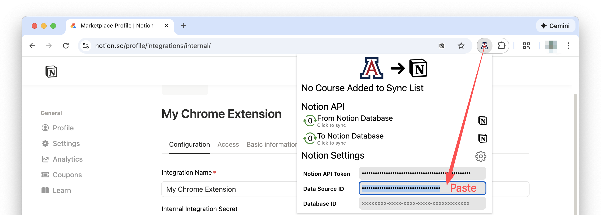
</picture>

### 4. Copy Notion Database ID to the Extension

1. Go back to the database [you've duplicated](#3-duplicate-database-template) in Notion Desktop App

2. Go to `...` &rarr; `Copy link`

<picture>
  <source
    srcset="README/02_3_4_copy_database_id_dark.png"
    media="(prefers-color-scheme: dark)"
  />
  
</picture>

3. Paste the link in Chrome search bar

4. Copy the part after `https://www.notion.so/username/` and before `?v=`

<picture>
  <source
    srcset="README/02_3_4_copy_part_dark.png"
    media="(prefers-color-scheme: dark)"
  />
  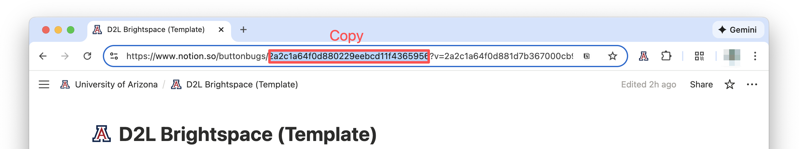
</picture>

5. Open the extension and paste that part in `Database ID`

<picture>
  <source
    srcset="README/02_3_4_paste_part_dark.png"
    media="(prefers-color-scheme: dark)"
  />
  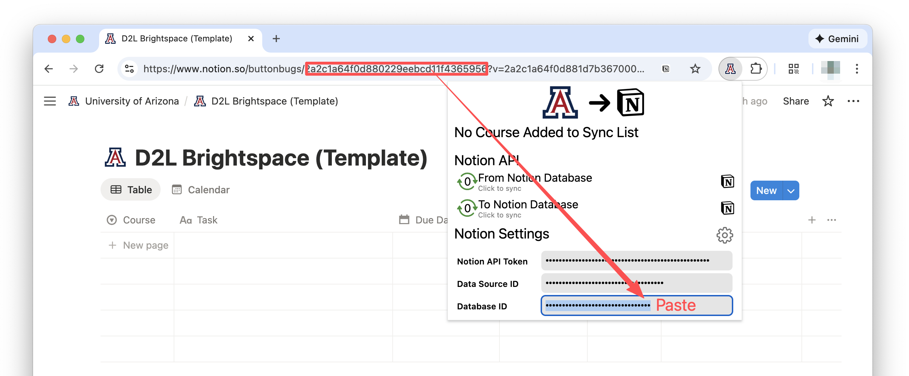
</picture>

## Add Courses to Sync

1. Open Arizona D2L Brightspace

2. Click one of the courses you want the extension to sync

3. Open the extension

4. Click `+` to the right of the course you want to add

<picture>
  <source
    srcset="README/03_1_add_course_1_dark.png"
    media="(prefers-color-scheme: dark)"
  />
  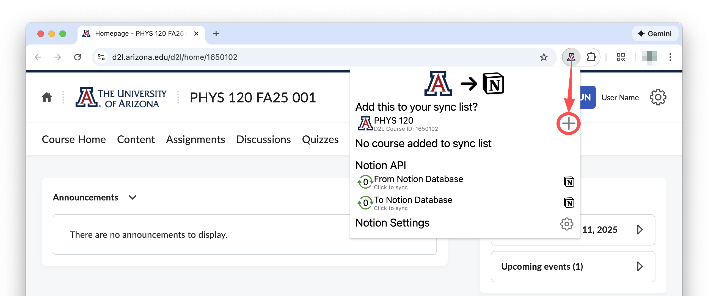
</picture>

5. Repeat Step `2.` to `4.` for other courses you want to add
<!--
<picture>
  <source
    srcset="README/03_1_add_course_2_dark.png"
    media="(prefers-color-scheme: dark)"
  />
  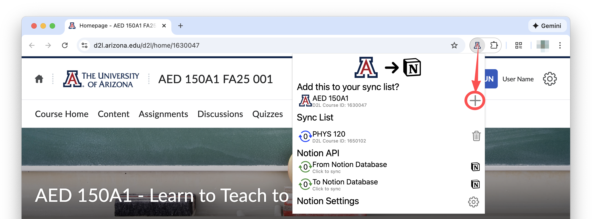
</picture>
-->
<picture>
  <source
    srcset="README/03_1_add_course_6_dark.png"
    media="(prefers-color-scheme: dark)"
  />
  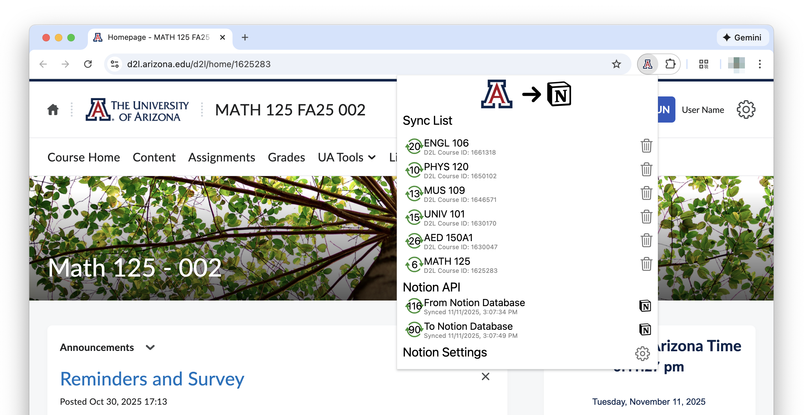
</picture>

### Finished? Great job👍!

Now the extension will automatically sync your course data to the Notion database each time D2L webpages load.

# Tips

Once [the above steps](#before-you-use) are completed, the `Arizona D2L to Notion` extension will automatically sync your course data to the Notion database each time D2L webpages load, so no further action is required.

## How to use

### Understand Visual Elements

**Colors**

 Completed

 In progress

 Waiting

 Error

**Numbers**

The numbers refer to the numbers of tasks synced or processed

### Functions

**Quickly Open Course Homepages**

👉 Click the course name of the course in sync list that you want to open.

**Remove Course from Sync List**

👉 Click 

**Resync**

👉 Click `From Notion Database` or `To Notion Databse` to start resyncing

**Quickly Open Database**

👉 Click  to the right of `From Notion Database` or `To Notion Databse`

### Notion Database
Want to learn more about [Notion Database](https://www.notion.com/help/category/databases) to improve your efficiency and productivity? Visit [Intro to databases](https://www.notion.com/help/intro-to-databases)!

## Dos and Don'ts

### Dos

- Change the database's name and [icon](https://www.notion.com/help/customize-and-style-your-content#page-icons-and-emojis)
- Add or change the cover and description of the database
- Change the task name
- Change the task status when the task is not finished
- Change the task type
- Add a task that does not exist in D2L
- Add or change due date to a task if it does not have a due date in D2L
- Add or change link to a task if it does not have a link in D2L
- Add or change [properties](https://www.notion.com/help/database-properties) beyond the template
- Change the colors and icons of the [properties](https://www.notion.com/help/database-properties)
- Writing content in the database's [subpage](https://www.notion.com/help/intro-to-databases#add-and-open-database-pages)

### Don'ts

- Change the course name if the its original name is in sync list
- Change the task's due date if the task has a due date in D2L
- Change link to a task if it the task has a link in D2L
- Change properties existing in [the template](https://buttonbugs.notion.site/2a2c1a64f0d880229eebcd11f4365956?v=2a2c1a64f0d881d7b367000cb9f4b112)
- Refresh the [Internal Integration Secret](https://developers.notion.com/docs/create-a-notion-integration#get-your-api-secret) (If you did refresh it, please [copy the Notion API Token again](#2-copy-notion-api-token-to-the-extension))

# Disclaimer
## Use it at your own risk
- This extension is provided “as is” without any guarantees or warranty.
- Use it at your own risk. We are not responsible for any damage, data loss, or issues that may come from using this extension.

## Not affiliated with any company, organization or school
- This extension is not affiliated with or endorsed by any company or organization mentioned here. All trademarks belong to their respective owners.

## Exact sync not guaranteed
- Because D2L may update its website over time, this extension may not always sync every task correctly. We do not guarantee that the data in your Notion database will exactly match your D2L.
- Please do not rely on this extension as your only source of information.
- We are not responsible if you miss an assignment because of a syncing error. We’re not responsible for any academic issues or failures that happen because of a syncing error.
- Make sure to check D2L regularly so you don’t overlook anything. Use this extension at your own risk.

